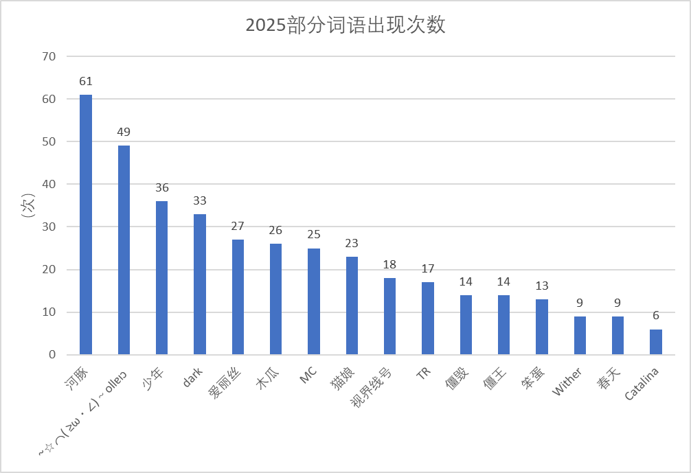
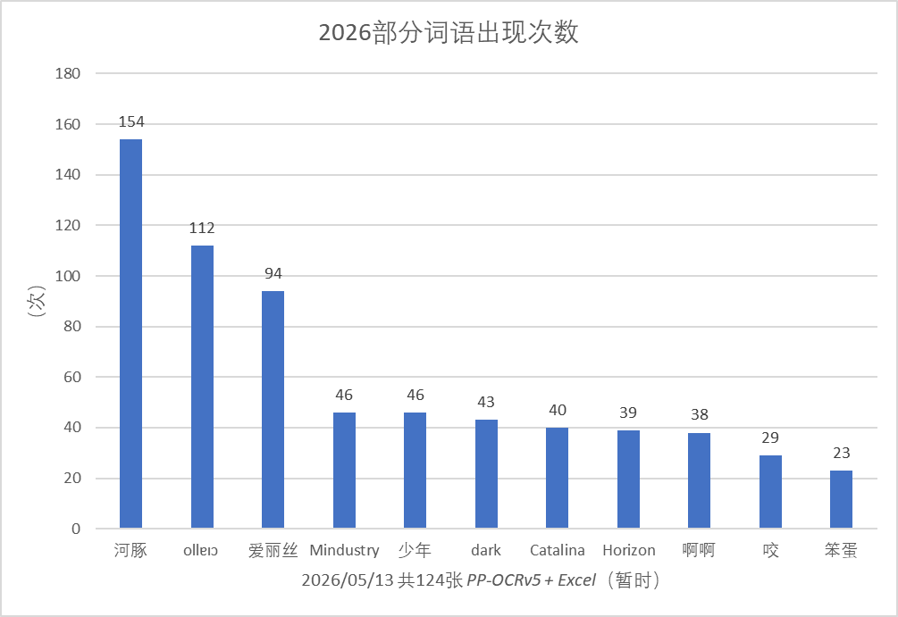

# 
《赛博史记》

  ↓ 浏览图库 ↓

  

<!--

  ↓ 提交内容 ↓

  

-->

<!--

建议使用 
  
   进行浏览
-->

* 记录一些有趣的 <b>回忆</b> 或 <s><b>黑历史</b></s> ，它们会以文字、图片等形式留存。
* 我没有任何想要伤害他人的意图，若造成不适请联系我删除相关内容。
* 是否以 <b>精选</b> 进行留存要取决于事件的 <b>影响力</b>、<b>感染力</b>。且排序仅仅与收录时间有关。

---
## 精选-往年

2025年度精选

---
### **1.僵王**

**所属：** 少年英雄派(梦安去)

**时间：** 2024/11/01-2024/12/01

**出自：** 僵尸毁灭工程

**相关：** [相关图片](../2025/PZ)

**详见：** **

---
### **2.大厨**

**所属：** 视界线号

**时间：** 2024/3/01-2024/11/01

**出自：** 僵尸毁灭工程

没了他，我们只能吃罐头。有了他，餐餐有人肉。人肉，香。

“你别吃我食材”

---
### **3.猫耳河豚**

**所属：** 沐桦

**时间：** **

**出自：** [绘谜画猜_(站外)](https://enazo.cn/)

某一局的主题是Minecraft，题目是河豚，当事人(画手)把河豚的身形简化成圆、蓝色鱼鳍画成了猫耳。

---
### **4.核囤**

**所属：** 沐桦

**时间：** 2024/12/01-2025/05/06

**出自：** 铁锈战争

**相关：** [防空宣传片](../2025/video/核囤痛苦时.mp4)

极其注重经济，大力建造**核反应堆(高级蛋)**、显著提高友军抗线能力、在我方心脏地带**放烟花给友军助威**。

---
### **5.原木的块**

**所属：** 少年英雄派(梦安去)

**时间：** 2024/11/27

**出自：** [绘谜画猜_(站外)](https://enazo.cn/)

**相关：** [原木的块_(2025/images_2025/原木的块.png)](../2025/images_2025/原木的块.png)

主题是Minecraft，题目是橡木原木，经过诸多提示后答出了“橡木的块”。

提示：x木x木|**少年：原木橡木**|提示：6

**少年：啊啊啊**|系统：4个字|系统：已加时

**少年：橡木的块**|提示：6|系统：少年表示猜不透

---
## 精选-本年(2026)

 展开 

### **1.河豚干的**

**所属：** 视界线号（HorizonLine）、沐桦（河豚）

**时间：** 2026/01/09

**出自：** 于2025/05/06晚09:15在群聊中以消息形式首次出现，之后长时间沉寂。直到2026/01/09再次复出，并迅速被大规模复读。
在后期进展中，1.衍生出了如“河豚偷吃”、“河豚怎么这么坏啊”等相关词汇。2.以“河豚”代指或替换某些事物的名词，例如“河豚瑞亚”(泰拉瑞亚)、“河豚工厂”、“河豚信号”。
在2025/08、2025/11月份末也短暂出现过。

**相关：** [记录合集](2026/河豚干的)

### **2.唉**

**所属：** 所有作唉之人

**时间：** 截至记录时2026/03/08，已有15944条与“唉”相关的聊天记录、4499条与“ai”相关的聊天记录，追溯耗时较大，暂时放弃。模糊时间大致是2025年。

**出自：** 大致演变过程为：唉->>哎/爱->>ai->>唉->>唉！！！！！！！！！！（更激烈）。最初该“情绪”并不参与任何话题，仅在随机的“无故犯病”发生时被大量复读。现已完全融入日常表达中，多数用于句首，且出现频率极高。

**相关：** 截至2026/04/26，已有17592条与“唉”相关的聊天记录。

**其他：** 续补：“唉！！！！！！”

### **3.啊啊啊啊啊啊**

**所属：** Catalina、WITHER

**时间：** 2025/04/**

**出自：** 首次出现于2025/04/22，由“Catalina”发送的“快点到啊啊啊啊啊啊啊啊”引起。2025/05，初步进入传染阶段，感染力极小，未具规模。2026/03，“WITHER”开始不定时且随机在群内发送“额啊啊啊啊啊啊啊啊”，该情况一直持续到2026/04月末，在这期间引起了大规模感染，主要表现有：大量复读、随机穿插在语句中、无故犯病等。

**相关：** 此外，“爱丽丝玛格特罗伊德、HorizonLine、darktemplar、河豚”也是该事件的重要参与者。

**其他：** 续补：“额啊啊啊啊啊啊啊啊啊啊啊啊啊啊！！！！！！”

### **4.名称**

**所属：** 人物

**时间：** 时间

**出自：** 描述

**相关：** 信息

**详见：** 详细

---
## 部分词语统计
 

---

